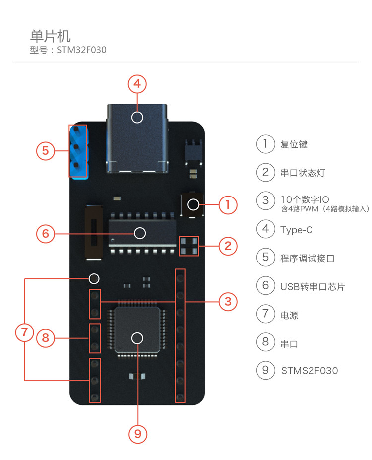
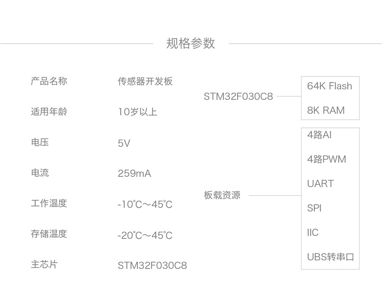

  
  

## 开发环境
 * CooCox CoIDE, a free and highly-integrated software development environment for ARM Cortex MCUs

## SPI
 * CS polarity : active low
 * Clock polarity : 1
 * Clock phase : 0
 * MSB-first
