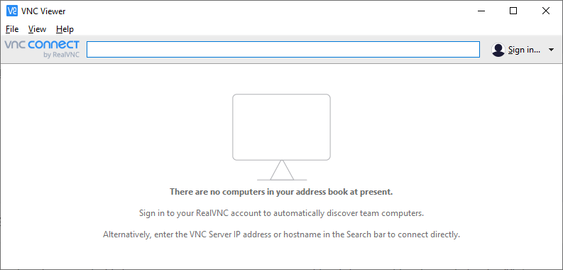
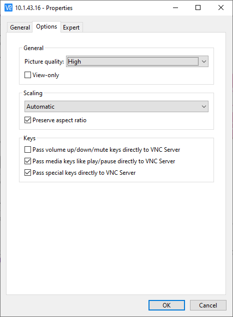

以root用户登录、将大连侧提供的RemotePanelEnv文件夹复制到/root/下、复制完成后的结构如下：

```
/root/
`-- RemotePanelEnv
    |-- iptables.sh
    |-- startvnc
    `-- vnc_client_watcher.sh
```

复制脚本文件

```bash
mount -oremount,rw / && \
mkdir -p ~/.vnc && \
cp -f ~/RemotePanelEnv/startvnc ~/.vnc/ && \
cp -f ~/RemotePanelEnv/iptables.sh /etc/init.d/ && \
chmod a+x ~/.vnc/startvnc && \
mount -oremount,ro /
```

安装VNC、mosquitto服务

```bash
mount -oremount,rw / && \
apt-get -y install tigervnc-scraping-server mosquitto libmosquitto-dev net-tools && \
mount -oremount,ro /
```

配置VNC密码（<span style='color:red'>12345678</span>）

```bash
mkdir -p ~/.vnc && echo "12345678" | vncpasswd -f > ~/.vnc/passwd
```

下载VNC Viewer

[https://www.realvnc.com/en/connect/download/viewer/](https://www.realvnc.com/en/connect/download/viewer/)

在VNC Viewer的地址栏输入本体的IP地址、押下回车后进行连接



初次连接时、画质会比较差、可在连接的属性中对画质进行设定

