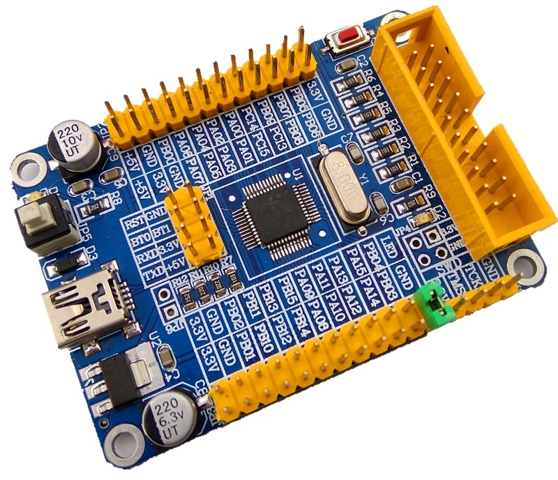

### STM32F030C8T6开发板使用ST-LINK V2下载程序的连线方法
 * ~~这个板子的SWDIO和SWCLK似乎接反了~~ (竟然是非官方的ST-LINK的引脚不对)
 * 板子需要独立供电

| STM32F030C8T6开发板 | ST-LINK |
| --- | --- |
| 3.3V | 3.3V |
| GND | GND |
| SWDIO | TMS |
| SWCLK | TCK |

### STM32F030C8T6开发板使用USB TTL下载程序的连线方法

| STM32F030C8T6开发板 | USB TTL |
| --- | --- |
| BT0 | +5 |
| GND | GND |
| TX | RX |
| RX | TX |

 * BT0为高电平、才能使用UART进行程序的下载

### STM32F030C8T6开发板上的LED
PORTC的Pin13

### Softwares
 * [LTspice电路模拟器](https://www.analog.com/en/design-center/design-tools-and-calculators/ltspice-simulator.html)

### STM32CubeMX Tutorial Series
 * [https://www.waveshare.com/wiki/STM32CubeMX_Tutorial_Series](https://www.waveshare.com/wiki/STM32CubeMX_Tutorial_Series)

### Reference
 * [stm32f0-timer-tutorial-and-counter-tutorial](https://letanphuc.net/2015/06/stm32f0-timer-tutorial-and-counter-tutorial/)
 * http://eleceng.dit.ie/frank/arm/BareMetalSTM32F0Discovery/
 * [stm32 ST-Link下载出现 No target connected解决办法](https://blog.csdn.net/slimmm/article/details/83446736)
 * [a smarter way to write micros()](http://micromouseusa.com/?p=296)
 * [Interfacing a PS2 (PlayStation 2) Controller - CuriousInventor Tutorials](http://store.curiousinventor.com/guides/PS2/)
 * [Controlling Servo Motor with Stm32f103](https://www.microcontroller-project.com/interfacing-servo-motor-with-stm32.html)
 * [http://julien.elfa-systemes.com/perso/](http://julien.elfa-systemes.com/perso/)
