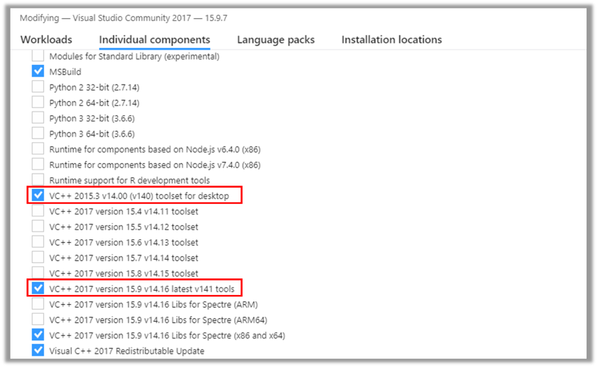
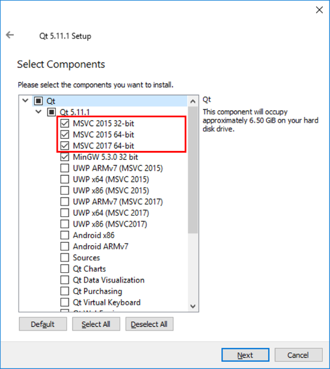
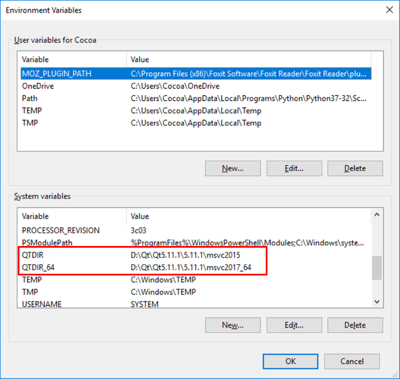

## Prerequisites
 * VS2017 Community Edition
 * QT (5.11.1 OR latest version)

## Installation
Be sure to install VS2017 first
### 1. VS2017 Community Edition
Make the items in red rectangle checked.  

### 2. QT
Make the items in red rectangle checked.  

### 3. Setup environment variables

